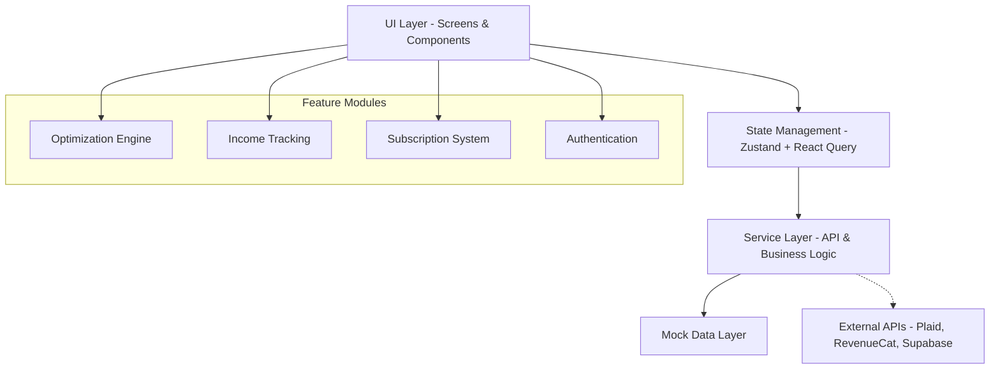
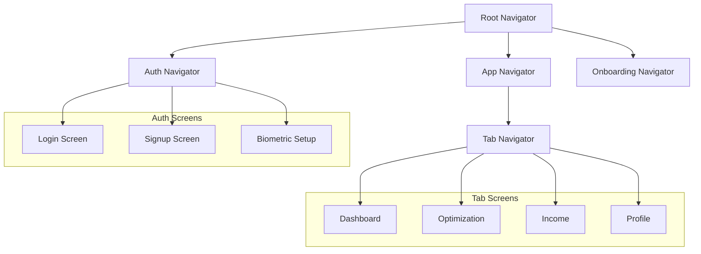

# Design Document

## Overview

SelfPay Week 1 Sprint implements a foundational React Native Expo application with TypeScript, focusing on creating a scalable architecture that supports mock data development while preparing for real API integration. The design emphasizes modularity, type safety, and developer experience through comprehensive tooling and clear separation of concerns.

## Architecture

### High-Level Architecture



### Technology Stack

- **Framework**: React Native with Expo SDK
- **Language**: TypeScript for type safety
- **State Management**: Zustand for global state, React Query for server state
- **Styling**: NativeWind (Tailwind CSS for React Native)
- **Navigation**: React Navigation v6 with nested navigators
- **Authentication**: Supabase Auth with biometric support
- **Payments**: RevenueCat for subscription management
- **Banking**: Plaid for account linking
- **Testing**: Jest + React Native Testing Library

### Folder Structure

```
src/
├── components/           # Reusable UI components
│   ├── ui/              # Base design system components
│   ├── forms/           # Form-specific components
│   └── charts/          # Chart and visualization components
├── screens/             # Screen components
│   ├── auth/           # Authentication screens
│   ├── onboarding/     # Onboarding flow screens
│   └── dashboard/      # Main app screens
├── features/           # Feature-specific modules
│   ├── optimization/   # Smart optimization engine
│   ├── income/        # Income tracking
│   ├── subscriptions/ # Subscription management
│   └── auth/          # Authentication logic
├── services/          # API and business logic services
├── hooks/            # Custom React hooks
├── stores/           # Zustand store definitions
├── navigation/       # Navigation configuration
├── types/           # TypeScript type definitions
├── utils/           # Utility functions
└── constants/       # App constants and configuration
mock/                # Mock data files
├── surgeData.json
├── recommendations.json
└── incomeData.json
```

## Components and Interfaces

### Core Type Definitions

```typescript
// Core data types
interface SurgeData {
  location: {
    lat: number;
    lng: number;
    name: string;
  };
  multiplier: number;
  platform: string;
  timestamp: string;
  duration: number;
}

interface Recommendation {
  id: string;
  type: "surge" | "demand" | "bonus";
  platform: string;
  title: string;
  description: string;
  estimatedEarnings: number;
  confidence: number;
  location?: string;
  timeWindow: {
    start: string;
    end: string;
  };
}

interface Transaction {
  id: string;
  amount: number;
  description: string;
  date: string;
  platform: string;
  category: string;
  accountId: string;
}

interface Account {
  id: string;
  name: string;
  type: "checking" | "savings";
  balance: number;
  platform: string;
  isConnected: boolean;
  lastSync: string;
}

interface SubscriptionStatus {
  isActive: boolean;
  tier: "free" | "premium" | "pro";
  expiresAt?: string;
  features: string[];
}
```

### Service Layer Design

#### Mock Data Service Pattern

```typescript
interface BaseService<T> {
  getData(): Promise<T>;
  validateData(data: unknown): data is T;
}

class MockDataService<T> implements BaseService<T> {
  constructor(
    private mockFilePath: string,
    private validator: (data: unknown) => data is T
  ) {}

  async getData(): Promise<T> {
    if (USE_MOCK_DATA) {
      return this.loadMockData();
    }
    return this.loadRealData();
  }
}
```

#### Feature Services

- **SurgeService**: Handles surge pricing data and recommendations
- **IncomeService**: Manages transaction data and income analytics
- **BankLinkService**: Handles Plaid integration for account linking
- **SubscriptionService**: Manages RevenueCat subscription operations
- **AuthService**: Handles Supabase authentication and token management

### State Management Design

#### Zustand Store Structure

```typescript
interface AuthStore {
  user: User | null;
  isAuthenticated: boolean;
  isLoading: boolean;
  login: (credentials: LoginCredentials) => Promise<void>;
  logout: () => Promise<void>;
  refreshToken: () => Promise<void>;
}

interface SubscriptionStore {
  status: SubscriptionStatus;
  isLoading: boolean;
  checkStatus: () => Promise<void>;
  purchase: (productId: string) => Promise<void>;
  restore: () => Promise<void>;
}

interface OnboardingStore {
  currentStep: number;
  responses: OnboardingResponses;
  isComplete: boolean;
  updateResponse: (step: number, response: any) => void;
  completeOnboarding: () => Promise<void>;
}
```

#### React Query Configuration

- Cache invalidation strategies for real-time data
- Background refetch for income and surge data
- Optimistic updates for user interactions
- Error retry policies with exponential backoff

### Navigation Architecture



## Data Models

### Mock Data Structure

#### Surge Data Model

```json
{
  "surgeZones": [
    {
      "id": "zone_1",
      "location": {
        "lat": 37.7749,
        "lng": -122.4194,
        "name": "Downtown SF"
      },
      "multiplier": 2.5,
      "platform": "uber",
      "timestamp": "2025-01-14T10:00:00Z",
      "duration": 3600
    }
  ],
  "recommendations": [
    {
      "id": "rec_1",
      "type": "surge",
      "platform": "uber",
      "title": "High Surge in Downtown",
      "description": "2.5x surge multiplier active",
      "estimatedEarnings": 45.5,
      "confidence": 0.85,
      "location": "Downtown SF",
      "timeWindow": {
        "start": "2025-01-14T10:00:00Z",
        "end": "2025-01-14T11:00:00Z"
      }
    }
  ]
}
```

#### Income Data Model

```json
{
  "accounts": [
    {
      "id": "acc_1",
      "name": "Chase Checking",
      "type": "checking",
      "balance": 2450.75,
      "platform": "chase",
      "isConnected": true,
      "lastSync": "2025-01-14T09:30:00Z"
    }
  ],
  "transactions": [
    {
      "id": "txn_1",
      "amount": 32.5,
      "description": "Uber ride earnings",
      "date": "2025-01-14T08:45:00Z",
      "platform": "uber",
      "category": "rideshare",
      "accountId": "acc_1"
    }
  ],
  "summary": {
    "totalEarnings": 1250.75,
    "weeklyGoal": 1500.0,
    "goalProgress": 0.834,
    "topPlatform": "uber"
  }
}
```

### Data Validation

Type guards and validation utilities ensure mock data integrity:

```typescript
function isSurgeData(data: unknown): data is SurgeData {
  return (
    typeof data === "object" &&
    data !== null &&
    "location" in data &&
    "multiplier" in data &&
    "platform" in data
  );
}

function validateMockData<T>(
  data: unknown,
  validator: (data: unknown) => data is T
): T {
  if (!validator(data)) {
    throw new Error("Invalid mock data structure");
  }
  return data;
}
```

## Error Handling

### Global Error Boundary

```typescript
interface ErrorBoundaryState {
  hasError: boolean;
  error?: Error;
  errorInfo?: ErrorInfo;
}

class GlobalErrorBoundary extends Component<Props, ErrorBoundaryState> {
  // Catches JavaScript errors anywhere in child component tree
  // Logs error details and shows fallback UI
  // Provides retry mechanisms for recoverable errors
}
```

### Service Error Handling

- Network error recovery with retry logic
- Graceful degradation to mock data when APIs fail
- User-friendly error messages with actionable guidance
- Offline mode detection and handling

### Form Validation

- Real-time validation with immediate feedback
- Accessibility-compliant error announcements
- Clear error messaging with resolution steps

## Testing Strategy

### Unit Testing Approach

```typescript
// Service testing with mock data
describe("SurgeService", () => {
  describe.skip("getSurgeData", () => {
    it("should return valid surge data from mock");
    it("should validate data structure");
    it("should handle network errors gracefully");
  });
});

// Component testing with React Native Testing Library
describe("OptimizationScreen", () => {
  describe.skip("rendering", () => {
    it("should display surge heatmap");
    it("should show recommendations list");
    it("should handle loading states");
  });
});
```

### Testing Infrastructure

- Jest configuration for React Native
- Mock implementations for external services
- Test utilities for common testing patterns
- Snapshot testing for UI components
- Integration tests for critical user flows

### Mock Data Testing

- Validation of mock data against TypeScript interfaces
- Consistency checks across related mock files
- Performance testing with large mock datasets

## Security Considerations

### Authentication Security

- Secure token storage using Expo SecureStore
- Biometric authentication integration
- Token refresh handling with automatic retry
- Session timeout and cleanup

### Data Protection

- Sensitive data encryption at rest
- Secure API communication with HTTPS
- Input sanitization and validation
- PII handling compliance

### Development Security

- Environment variable protection
- API key management for different environments
- Secure mock data (no real user information)

## Performance Optimization

### React Native Optimizations

- Lazy loading for non-critical screens
- Image optimization and caching
- Bundle size optimization with tree shaking
- Memory management for large datasets

### State Management Performance

- Selective re-rendering with Zustand selectors
- React Query caching strategies
- Debounced user input handling
- Optimistic updates for better UX

### Mock Data Performance

- Efficient JSON parsing and validation
- Caching of frequently accessed mock data
- Pagination for large datasets
- Background data loading

## Development Workflow

### Mock-First Development

1. Define TypeScript interfaces
2. Create comprehensive mock data
3. Implement UI components with mock data
4. Add service layer with mock/real data switching
5. Implement real API integration (future sprints)

### Code Organization Principles

- Feature-based folder structure
- Clear separation of concerns
- Consistent naming conventions
- Comprehensive TypeScript coverage
- Export statements to prevent import errors

### Quality Gates

- TypeScript compilation without errors
- All tests passing (even if skipped)
- Expo build success
- Mock data validation
- Code review checklist compliance
